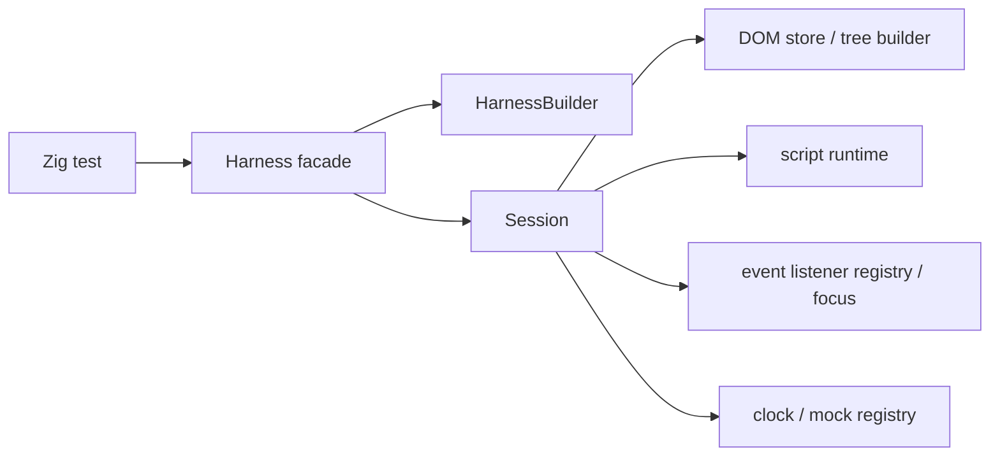

# Architecture

## Intent

`zig/` is a clean-room rewrite workspace for the next generation of `browser-tester`.
The workspace is guided by [`next.md`](../../next.md) and can use the Rust workspace under [`../next/`](../../next) as a reference, but the Zig codebase is the source of truth for this rewrite.

The starting constraints are fixed up front:

- deterministic execution is a product contract
- the public surface stays centered on `Harness`
- ownership is split by subsystem before feature growth
- mocks are first-class test APIs when they become public

## Goals

- Run browser-style tests in a single process.
- Keep time, randomness, and browser-like APIs deterministic.
- Support form-heavy UI tests without launching a real browser.
- Make subsystem ownership visible in code and docs before feature growth starts.

## Non-Goals

- real rendering or layout
- general-purpose network I/O
- service workers
- full iframe semantics
- full browser compatibility
- broad Web API coverage without an explicit capability decision

## Workspace Layout

```text
zig/
  src/
    root.zig        # public facade
    harness.zig     # Harness and HarnessBuilder
    session.zig     # internal session state
    mocks.zig       # internal mock families and registry
    dom.zig         # internal HTML parsing and DOM tree storage
    script.zig      # internal script runtime and host bindings
    errors.zig      # public error surface
  doc/
    architecture.md
    capability-matrix.md
    implementation-guide.md
    limitations.md
    mock-guide.md
    publish-checklist.md
    roadmap.md
    subsystem-map.md
```

## Current Public Surface

- `Harness`
- `HarnessBuilder`
- `StorageSeed`
- `MockRegistry`
- `Error`
- `Result(T)`
- `OpenCall`
- `OpenMocks`
- `CloseCall`
- `CloseMocks`
- `PrintCall`
- `PrintMocks`
- `ScrollMethod`
- `ScrollCall`
- `ScrollMocks`
- `HarnessBuilder` can capture URL, HTML, local storage, session storage, a `Math.random()` / `crypto.randomUUID()` seed, and open/close/print/scroll bootstrap failure seeds before ownership moves into `Session`.
- `Harness` now exposes constructor helpers, read-only inspection methods, user actions, deterministic clock helpers, and typed test-only mock families.

`Session` stays internal for now.
It owns the copied configuration state, the internal DOM store, the internal script runtime state, the event listener registry, the focus/target selector-state snapshots, the queued timers and microtasks, the fake clock state, and the mock registry.

`Harness` now exposes `assertExists()`, `assertValue()`, `assertChecked()`, and `dumpDom()` for read-only inspection, plus `nowMs()`, `advanceTime()`, `flush()`, `mocksMut()`, `fetch()`, `alert()`, `confirm()`, `prompt()`, `readClipboard()`, `writeClipboard()`, `captureDownload()`, `open()`, `close()`, `print()`, `scrollTo()`, `scrollBy()`, `navigate()`, and `setFiles()` for deterministic runtime control, and `click()`, `typeText()`, `setChecked()`, `setSelectValue()`, `focus()`, `blur()`, `submit()`, and `dispatch()` for user-like actions; `click()` also drives anchor navigation, download, and reset observation deterministically, and script-side `HTMLElement.click()` / `HTMLElement.focus()` / `HTMLElement.blur()` update the action / focused element state from inline scripts; the same click/default-action path also dispatches `CommandEvent.command` / `CommandEvent.source` for `HTMLButtonElement.command` / `HTMLButtonElement.commandForElement`, and `HTMLButtonElement.type` / `HTMLButtonElement.value` reflect the button's `type` / `value` attributes.
Inline scripts can also read and set text-selection state on supported `input` / `textarea` controls through `selectionStart`, `selectionEnd`, `selectionDirection`, `setSelectionRange(...)`, `setRangeText(...)`, and `select()`, can observe document-level `selectionchange` handlers, and can inspect minimal `window.getSelection()` / `document.getSelection()` snapshots for the active text control and call `collapseToStart()` / `collapseToEnd()` / `containsNode(...)` / `removeAllRanges()` / `collapse(node, offset)` / `extend(node, offset)` / `setBaseAndExtent(...)` / `deleteFromDocument()` / `setPosition(node, offset)` / `selectAllChildren(node)` / `addRange(range)` / `removeRange(range)` / `getRangeAt(0)` / `Range.cloneRange()` / `Range.cloneContents()` / `Range.createContextualFragment()` / `Range.selectNode()` / `Range.selectNodeContents()` / `Range.setStart()` / `Range.setEnd()` / `Range.collapse([toStart])` / `Range.insertNode()` / `Range.surroundContents()` / `Range.deleteContents()` / `Range.isPointInRange(...)` / `Range.comparePoint(...)` / `Range.compareBoundaryPoints(...)` / `Range.extractContents()`, while `document.createRange()` returns a minimal empty `Range` snapshot; unsupported controls read as `null` and reject selection mutations explicitly.
Inline scripts can schedule microtasks with `queueMicrotask()` / `window.queueMicrotask()` and timers with `setTimeout()` / `window.setTimeout()` / `clearTimeout()` / `window.clearTimeout()` plus repeating timers with `setInterval()` / `window.setInterval()` / `clearInterval()` / `window.clearInterval()`, `window.performance.now()` reads from the fake clock, and `advanceTime()` / `flush()` drain due timers plus queued microtasks in the session state.
`Harness.open()`, `Harness.close()`, `Harness.print()`, `Harness.scrollTo()`, and `Harness.scrollBy()` forward into the typed open/close/print/scroll mock families so tests can capture popup requests, window shutdown/print invocations, beforeprint/afterprint lifecycle handlers, and scroll requests without exposing a browser renderer.
`assertExists()` and the action methods resolve through the shared DOM selector engine, which now covers class selectors, universal selectors, compound simple selectors, descendant combinators, child combinators, sibling combinators, `:scope`, `:has(...)`, `:lang(...)`, `:dir(...)`, `:not(...)`, `:is(...)`, `:where(...)`, `:focus`, `:focus-visible`, `:focus-within`, `:target`, `:defined`, bounded `:nth-*` forms including `of <selector-list>` support on the `nth-child`, `nth-last-child`, `nth-of-type`, and `nth-last-of-type` families, and a bounded structural/state pseudo-class slice including `:blank`.
Inline scripts and event handlers also reuse that selector engine through `document.querySelector()`, `element.querySelector()`, `Element.matches()`, and `Element.closest()`.
Collection lookups reuse it through `document.querySelectorAll()` and `element.querySelectorAll()`, which return minimal `NodeList` snapshots with `length`, `item(index)`, `forEach(callback[, thisArg])`, `keys()`, `values()`, and `entries()`.
`document.scripts` and `document.anchors` expose live `HTMLCollection` surfaces with `length`, `item(index)`, `namedItem(name)`, `keys()`, `values()`, and `entries()`.
`document.forms`, `form.elements` / `form.length` (including controls associated via `form=` outside the subtree in document order), `select.options` / `select.length`, `select.selectedOptions`, `select.selectedIndex`, `select.size`, and `select.type`, plus `HTMLOptionElement.label` / `defaultSelected` / `text` / `index` and `HTMLOptGroupElement.label`, `fieldset.elements`, `datalist.options`, `HTMLMapElement.name` / `map.areas`, `table.tBodies`, `document.images`, `document.links`, `document.embeds`, `document.plugins`, `document.applets`, and `document.all` expose live collection surfaces with the same bounded `HTMLCollection` model.
`HTMLSelectElement.add(option[, before])` / `HTMLSelectElement.remove(index?)` mutate the same live option state as `select.options.add(option)` / `select.options.remove(index)`, `thead` / `tbody` / `tfoot` expose `insertRow([index])` / `deleteRow([index])` on their live section row collections, `table.caption` / `table.tHead` / `table.tFoot` stay in sync with `HTMLTableElement.createCaption()` / `deleteCaption()` / `HTMLTableElement.createTHead()` / `deleteTHead()` / `HTMLTableElement.createTBody()` / `HTMLTableElement.createTFoot()` / `deleteTFoot()`, and `HTMLTableElement.align` / `border` / `frame` / `rules` / `summary` / `width` / `bgColor` / `cellPadding` / `cellSpacing` reflect the legacy table attributes with null-to-empty behavior on the latter three, while `HTMLTableSectionElement` / `HTMLTableRowElement` / `HTMLTableCellElement` carry the rest of the legacy table reflection surface (`align` / `ch` / `chOff` / `vAlign` on sections, `align` / `ch` / `chOff` / `vAlign` / `bgColor` on rows, and `align` / `axis` / `height` / `width` / `ch` / `chOff` / `noWrap` / `vAlign` / `bgColor` on cells).
`document.styleSheets` exposes a live `StyleSheetList` surface with `length`, `item(index)`, `forEach(callback[, thisArg])`, `keys()`, `values()`, and `entries()`, and the nested `CSSRuleList` exposed through `cssRules` now also supports `forEach(callback[, thisArg])`; the minimal parser currently covers simple qualified rules plus bounded `@media` / `@supports` / `@supports-condition` / `@document` / `@container` / `@starting-style` / `@position-try` / `@scope` / `@keyframes` / `@font-face` / `@font-feature-values` / `@font-palette-values` rules with `CSSFontPaletteValuesRule` exposing `name`, `fontFamily`, `basePalette`, `overrideColors`, and writable `CSSFontPaletteValuesRule.cssText` / `@color-profile` / `@page` / `@layer` block / statement rules / `@property` block rules with writable `CSSPropertyRule.cssText` / `@counter-style` rules with `name`, `system`, `symbols`, `negative`, `prefix`, `suffix`, `range`, `pad`, `fallback`, `speakAs`, `additiveSymbols`, and writable `CSSCounterStyleRule.cssText`, plus `@charset` / `@import` / `@namespace` rules in inline `<style>` sheets, and `CSSStyleRule.style` is exposed as a live writable `CSSStyleDeclaration`, `CSSFontFaceRule.style, writable `CSSFontFaceRule.cssText`, and writable `CSSKeyframeRule.keyText` / `CSSKeyframesRule.cssText`, writable top-level `CSSStyleRule.selectorText`, `CSSStyleRule.cssText`, `CSSPageRule.selectorText` for top-level `@page` rules, `CSSPageRule.cssText`, `CSSMediaRule.cssText`, `CSSMediaRule.insertRule()` / `deleteRule()` on top-level `@media` rules, writable `CSSPageRule.style`, `CSSRule.type` exposes the legacy CSSOM integer mapping for classic rule kinds (with newer at-rules returning `0`), and `CSSRule.parentStyleSheet` returns the owning stylesheet on rule objects, and `CSSRule.parentRule` returns the immediate owning rule on nested rules, and `CSSStyleSheet.ownerNode` returns the owner element, while `CSSStyleSheet.href` / `CSSStyleSheet.title` / `CSSStyleSheet.disabled` / `CSSStyleSheet.media` expose owner metadata, with `CSSStyleSheet.media.mediaText` writable and `CSSStyleSheet.media.appendMedium()` / `deleteMedium()` available on stylesheet media lists, `CSSStyleSheet.disabled` toggles the owner element's `disabled` attribute, and `CSSMediaRule.media` is exposed as a writable minimal `MediaList` surface, and read-only `CSSMediaRule.matches` mirrors the current seeded `window.matchMedia(...)` result, while writable `CSSMediaRule.conditionText` rewrites the owning block in place while preserving nested rules, and writable `CSSSupportsRule.cssText` / `CSSContainerRule.cssText` rewrite their owning blocks in place while preserving nested rules, and `CSSSupportsRule.insertRule()` / `deleteRule()` and `CSSContainerRule.insertRule()` / `deleteRule()` are available on top-level `@supports` / `@container` rules, while `CSSImportRule.media` remains read-only as the same minimal `MediaList` surface, with `CSSImportRule.styleSheet` / `CSSStyleSheet.ownerRule` remaining null linkage surfaces, with `CSSImportRule.supportsText` / `CSSImportRule.layerName` expose read-only metadata, and `CSSSupportsConditionRule.name` is exposed on `@supports-condition` rules with writable `cssText` and an empty deterministic `cssRules` slice for now, with `mediaText`, `length`, `item(index)`, and iterator-style `keys()`, `values()`, and `entries()` helpers on the navigator `StringList` / `MimeTypeArray` surfaces; stylesheet owner elements also expose reflected `media` and `rel` / `relList` / `relList.supports()` / `relList.replace()` / `hreflang` / `charset` / `crossOrigin` / `disabled`, with `HTMLStyleElement.sheet` / `HTMLLinkElement.sheet` returning the stylesheet owner linkage, and `CSSStyleSheet.insertRule()` / `deleteRule()` / `replaceSync()` are available on inline `<style>` owners. `CSSFontFeatureValuesRule.cssText` and `CSSColorProfileRule.cssText` are writable too.
`CSSStartingStyleRule.cssText` and `CSSPositionTryRule.cssText` are writable too.
`CSSLayerBlockRule.nameText` / `CSSLayerStatementRule.nameText` and writable `CSSLayerBlockRule.cssText` / `CSSLayerStatementRule.cssText` are available on `@layer` rules and rewrite the owning block in place while preserving nested rules; `CSSLayerStatementRule.nameList` exposes the comma-separated names as a `DOMStringList`.
`CSSScopeRule.start` / `CSSScopeRule.end` are available on `@scope` rules; the getters expose the scope root and scope limit strings (or `null` when absent), and `CSSScopeRule.cssText` / `CSSScopeRule.cssRules` remain available on the same slice.
`CSSKeyframesRule.cssText` is writable on nested `@keyframes` rules, and `CSSKeyframesRule.appendRule()`, `deleteRule()`, and `findRule()` are also available on the nested keyframe list. `CSSMediaRule.insertRule()` and `CSSMediaRule.deleteRule()` are available on top-level `@media` rules, and `CSSSupportsRule.insertRule()` / `CSSSupportsRule.deleteRule()` and `CSSContainerRule.insertRule()` / `CSSContainerRule.deleteRule()` are available on top-level `@supports` / `@container` rules.
`CSSContainerRule` also exposes `containerName` and `containerQuery`, with `containerQuery` returning the specified query text without logical simplification, and `CSSContainerRule.conditionText` / `CSSContainerRule.cssText` are writable on `@container` rules while preserving nested rules.
`CSSDocumentRule.conditionText` / `CSSDocumentRule.cssText` are writable on `@document` rules and rewrite the owning block in place while preserving nested rules.
`HTMLAnchorElement.href` / `HTMLAnchorElement.rel` / `HTMLAnchorElement.relList` / `HTMLAnchorElement.download` / `HTMLAnchorElement.target` / `HTMLAnchorElement.ping` / `HTMLAnchorElement.hreflang` / `HTMLAnchorElement.referrerPolicy` / `HTMLAnchorElement.type` / `HTMLAreaElement.href` / `HTMLAreaElement.rel` / `HTMLAreaElement.relList` / `HTMLAreaElement.download` / `HTMLAreaElement.target` / `HTMLAreaElement.ping` / `HTMLAreaElement.alt` / `HTMLAreaElement.coords` / `HTMLAreaElement.shape` / `HTMLAreaElement.noHref` / `HTMLAreaElement.hreflang` / `HTMLAreaElement.referrerPolicy` / `HTMLAreaElement.type` are reflected string attributes that feed the deterministic download/open click slice, `HTMLAnchorElement.text` is exposed as a `textContent` alias on anchors, and the same hyperlink elements also expose read-only URL decomposition properties (`origin`, `protocol`, `host`, `hostname`, `port`, `username`, `password`, `pathname`, `search`, `hash`), while `HTMLLinkElement` / `HTMLScriptElement` / `HTMLStyleElement` also expose `blocking` as a `DOMTokenList` with supported token `render`, but render-blocking behavior itself is not modeled, and `HTMLScriptElement` also exposes reflected `src`, `charset`, `text`, `type`, `async`, `defer`, `noModule`, `crossOrigin`, `integrity`, `referrerPolicy`, and `fetchPriority` metadata on the same script surface. `HTMLMetaElement` also exposes reflected `name`, `content`, `httpEquiv`, `charset`, and `media` metadata on the same modern reflection slice. `HTMLTrackElement` also exposes modern track reflection for `kind`, `src`, `srclang`, `label`, `default`, `readyState`, and `track`, with `track` modeled as a minimal `TextTrack` snapshot that exposes `kind`, `label`, `language`, `mode`, and `readyState`. `HTMLMediaElement` / `HTMLAudioElement` / `HTMLVideoElement` also expose deterministic playback state for `currentTime`, `duration`, `paused`, `seeking`, `ended`, `readyState`, `networkState`, `muted`, `volume`, `defaultPlaybackRate`, `playbackRate`, and `preservesPitch`, plus the boolean flag `disableRemotePlayback`, and deterministic `load()`, `pause()`, and `canPlayType(type)` methods, while `HTMLVideoElement` also exposes `disablePictureInPicture`; the underlying media pipeline and playback-specific events such as `volumechange` and `ratechange` are not modeled.
`HTMLDataElement.value` and `HTMLTimeElement.dateTime` are also exposed as modern machine-readable content reflections on `data` and `time` elements; `time.dateTime` falls back to text content when `datetime` is absent.
`table.rows` / `tbody.rows` / `thead.rows` / `tfoot.rows` / `tr.cells` expose live row and cell `HTMLCollection` surfaces; `HTMLTableElement.insertRow([index])` / `HTMLTableElement.deleteRow([index])` and `HTMLTableRowElement.insertCell([index])` / `HTMLTableRowElement.deleteCell([index])` mutate those same collections; `HTMLTableRowElement.rowIndex` / `sectionRowIndex`, `HTMLTableCellElement.cellIndex`, and `HTMLTableCellElement.colSpan` / `rowSpan` / `headers` plus `HTMLTableHeaderCellElement.scope` / `abbr` expose the live positions and reflection state; `HTMLTableColElement.span` / `width` / `align` / `ch` / `chOff` / `vAlign` / `bgColor` expose reflected column state on `col` / `colgroup` elements, `HTMLTableElement.align` / `border` / `frame` / `rules` / `summary` / `width` / `bgColor` / `cellPadding` / `cellSpacing` expose the legacy table reflection surface, and `HTMLTableSectionElement` / `HTMLTableRowElement` / `HTMLTableCellElement` carry the rest of the legacy table reflection surface (`align` / `ch` / `chOff` / `vAlign` on sections, `align` / `ch` / `chOff` / `vAlign` / `bgColor` on rows, and `align` / `axis` / `height` / `width` / `ch` / `chOff` / `noWrap` / `vAlign` / `bgColor` on cells); `getElementsByTagName()`, `getElementsByTagNameNS()`, and `getElementsByClassName()` expose live `HTMLCollection` surfaces on `Document` and `Element`, while `document.getElementsByName()` exposes a live `NodeList` surface on `Document`.
The stylesheet owner element slice also includes reflected `type`, `hreflang`, `charset`, `imageSrcset`, `imageSizes`, `fetchPriority`, and `crossOrigin` on `HTMLLinkElement`, and `HTMLLinkElement` / `HTMLScriptElement` / `HTMLStyleElement` also expose `blocking` as a `DOMTokenList` with supported token `render`, but render-blocking behavior itself is not modeled, and `HTMLScriptElement` also exposes reflected `src`, `charset`, `text`, `type`, `async`, `defer`, `noModule`, `crossOrigin`, `integrity`, `referrerPolicy`, and `fetchPriority` metadata; anchor/area href / rel / relList / target / ping / alt / coords / shape / noHref / hreflang / referrerPolicy / type reflection feeds the deterministic open click slice, `input` type=image also exposes modern image-input reflection for `src`, `alt`, `useMap`, `width`, and `height`, and `HTMLAnchorElement.text` is exposed as a `textContent` alias on anchors.
It also includes reflected `referrerPolicy`, `integrity`, and `as` on `HTMLLinkElement`.
`element.labels` exposes a live `NodeList` on labelable controls and `fieldset`; `HTMLLabelElement.htmlFor` / `control` / `form` are available on label elements; `form` follows the labeled control's form owner when one exists; `HTMLProgressElement` and `HTMLMeterElement` also expose the modern reflected numeric slice (`value`, `max`, `position` on progress; `value`, `min`, `max`, `low`, `high`, `optimum` on meter) plus `form` and `labels`, `HTMLOutputElement` also exposes `type`, `defaultValue`, `value`, `htmlFor`, `form`, `labels`, `willValidate`, `validity`, `validationMessage`, `checkValidity()`, `reportValidity()`, and `setCustomValidity()` as part of the same form-control slice; `HTMLObjectElement` also exposes `data`, `type`, `name`, `width`, `height`, `useMap`, `form`, `contentDocument`, `contentWindow`, `getSVGDocument()`, `willValidate`, `validity`, `validationMessage`, `checkValidity()`, `reportValidity()`, and `setCustomValidity()`, with the embedded browsing-context getters modeled as `null` in this workspace; `HTMLLegendElement.form` follows the same form-owner rule when the legend is a direct child of a `fieldset`, and `HTMLFieldSetElement.form` follows the same owner rule for the fieldset's owning form; `HTMLFieldSetElement.type` returns `"fieldset"`; `Element.children`, `document.children`, `document.childNodes`, `element.childNodes`, and `template.content` expose live child-element / child-node surfaces with the same bounded collection model, and `template.content` also shares the same detached fragment traversal helpers (`isConnected`, `hasChildNodes()`, `firstChild`, `lastChild`, `nextSibling`, `previousSibling`, `nextElementSibling`, and `previousElementSibling`); `HTMLTemplateElement.shadowRootMode` / `shadowRootDelegatesFocus` / `shadowRootClonable` / `shadowRootSerializable` / `shadowRootCustomElementRegistry` are reflected on `<template>` elements and leave `template.content` as the same inert `DocumentFragment` slice; `select.options` also accepts `add(option)` / `remove(index)` mutation helpers, and `form.length` / `select.length` mirror the corresponding live collection counts. `HTMLMediaElement` / `HTMLAudioElement` / `HTMLVideoElement` also expose deterministic playback state for `currentTime`, `muted`, `volume`, `defaultPlaybackRate`, `playbackRate`, and `preservesPitch`, plus deterministic `load()`, `pause()`, and `canPlayType(type)` methods, but the underlying media pipeline and playback-specific events such as `volumechange` and `ratechange` are not modeled. Inline bootstrap also exposes `document.currentScript`, `document.readyState`, and `document.onreadystatechange` while scripts are executing.
Inline scripts also use attribute reflection methods like `getAttribute()`, `getAttributeNS()`, `getAttributeNode()`, `getAttributeNodeNS()`, `setAttributeNode()`, `setAttributeNodeNS()`, `removeAttributeNode()`, `setAttribute()`, `setAttributeNS()`, `removeAttribute()`, `removeAttributeNS()`, `hasAttribute()`, `hasAttributeNS()`, `hasAttributes()`, `getAttributeNames()`, and `toggleAttribute()`, which update the shared DOM attribute store and keep selectors plus form-control getters in sync. `Element.attributes` exposes a live `NamedNodeMap` surface with `length`, `item(index)`, `getNamedItem(name)`, `getNamedItemNS(namespace, localName)`, `setNamedItem(...)`, `setNamedItemNS(...)`, `removeNamedItem(...)`, `removeNamedItemNS(...)`, `keys()`, `values()`, `entries()`, and `forEach(callback[, thisArg])`. `Element.innerText` and `Element.outerText` are also available as deterministic `textContent`-like aliases on Element nodes and reuse the same shared text store. The reflected `id`, `title`, `role`, `slot`, `part`, `ariaLabel`, `ariaDescription`, `ariaRoleDescription`, `ariaHidden`, `lang`, `dir`, `hidden`, `inert`, `translate`, `draggable`, `disabled`, `required`, `noValidate`, `formNoValidate`, `name`, `defaultValue`, `defaultChecked`, `min`, `max`, `step`, `minLength`, `maxLength`, `multiple`, `type`, `placeholder`, `pattern`, `nonce`, `autocapitalize`, `autocomplete`, `autofocus`, `spellcheck`, `inputMode`, `enterKeyHint`, `readOnly`, `tabIndex`, `accessKey`, `contentEditable`, and `isContentEditable` state stays visible through the selector engine as well, `HTMLFormElement.autocomplete` and `HTMLSelectElement.autocomplete` reflect the autofill hint surface with `on` / `off` semantics, and supported form controls also surface a minimal `ValidityState` snapshot through `validity`, including `typeMismatch` and `patternMismatch` on supported text-like inputs; supported `number` / `range` / `date` / `datetime-local` / `time` / `month` / `week` controls and `HTMLOutputElement` also expose `valueAsNumber` getters and setters and `valueAsDate` getters and setters where applicable.
The form submission reflection slice is also implemented, including `form.action`, `form.method`, `form.enctype`, `form.encoding`, `form.target`, `form.acceptCharset`, `form.name`, `form.rel`, `form.relList`, and submit-control overrides `formAction` / `formMethod` / `formEnctype` / `formTarget`; action URLs resolve against the current location and method/enctype stay limited to known values, and `form.relList.add()` / `remove()` / `toggle()` / `replace()` / `supports()` are available with `supports()` limited to `noreferrer` / `noopener` / `opener`, and script-side `form.submit()` / `form.requestSubmit()` / `form.reset()` dispatch `submit` and `reset` events without real navigation while `SubmitEvent.submitter` reflects the explicit submitter on submit events from submit-button clicks and `requestSubmit(submitter)`. The same slice also includes `new FormData(form)` plus `FormData.append()` / `delete()` / `get()` / `getAll()` / `has()` / `set()` / `toString()` and `formdata` events that expose `event.formData` after a non-canceled submit. Form-associated controls also expose read-only `form` owner reflection through the explicit `form` attribute or the nearest owning `form` / `select` chain, `HTMLDialogElement.open` / `HTMLDialogElement.returnValue` / `HTMLDialogElement.closedBy` / `show()` / `showModal()` / `requestClose([returnValue])` / `close([returnValue])` are available on dialog elements as a deterministic cancel/close-event slice, and `HTMLDetailsElement.name` / `HTMLDetailsElement.open` are available on details elements as a deterministic toggle-event slice where the first `summary` child toggles `open`; the modern popover API slice (`popover`, `showPopover()`, `hidePopover()`, `togglePopover()`, `popoverTargetElement`, `popoverTargetAction`, and `:popover-open`) is available on HTML elements with deterministic toggle events and button/input target activation that can also be driven by script-side `HTMLElement.click()`, while supported `number` / `range` / `date` / `datetime-local` / `time` / `month` / `week` controls also expose `valueAsNumber` getters and setters and `valueAsDate` getters and setters, while `HTMLInputElement.list` resolves the associated `datalist` element by `id` or `null`, `HTMLInputElement.accept`, `HTMLInputElement.size`, and `HTMLInputElement.capture` are available on supported inputs as modern file/text entry reflections, `input[type=color]` also exposes `alpha` and `colorSpace`, and `input` type=image also exposes modern image-input reflection for `src`, `alt`, `useMap`, `width`, and `height`, `HTMLInputElement.indeterminate` feeds the existing `:indeterminate` selector state, and `HTMLInputElement.showPicker()` / `HTMLSelectElement.showPicker()` are available as deterministic no-op surfaces. The same click/default-action path also drives the command-button slice, where `HTMLButtonElement.command` / `HTMLButtonElement.commandForElement` dispatch `CommandEvent.command` / `CommandEvent.source` and reuse the existing dialog and popover helpers.
Those same supported controls also expose `stepUp()` / `stepDown()` with the workspace's step-aware date/time/month/week handling.
Inline scripts also use class and dataset views on `Element` through `className`, `classList` (including `value`, `item(index)`, and `replace()`), and `dataset`, which stay aligned with the same shared attribute store.
`classList`, `part`, and `relList` also expose `keys()`, `values()`, `entries()`, and `forEach(callback[, thisArg])` on the same token store.
`HTMLAnchorElement.relList`, `HTMLAreaElement.relList`, and stylesheet-owner `relList` surfaces also expose `add()`, `remove()`, and `toggle()` while retaining `replace()` and `supports()`.
Inline scripts also use document/window alias surfaces on `Document`, `Window`, and `Element` through `document.documentElement`, `document.head`, `document.body`, `document.scrollingElement`, `document.title`, `document.location`, `document.URL`, `document.documentURI`, `document.baseURI`, `document.defaultView`, `document.origin`, `document.domain`, `document.visibilityState`, `document.hidden`, `document.hasFocus()`, `document.ownerDocument`, `document.parentNode`, `document.parentElement`, `document.firstElementChild`, `document.lastElementChild`, `document.childElementCount`, `window.window`, `window.self`, `window.top`, `window.parent`, `window.opener`, `window.frameElement`, `window.closed`, `window.children`, `window.frames`, `window.length`, `window.navigator` (`userAgent`, `appCodeName`, `appName`, `appVersion`, `product`, `productSub`, `vendor`, `vendorSub`, `mimeTypes`, `pdfViewerEnabled`, `doNotTrack`, `javaEnabled()`, `plugins` (`length`, `item(index)`, `namedItem(name)`, `keys()`, `values()`, `entries()`, `forEach(callback[, thisArg])`, `refresh()`, `toString()`), `platform`, `language`, `cookieEnabled`, `onLine`, `webdriver`, `hardwareConcurrency`, `maxTouchPoints`), `window.performance` (`now()` / `timeOrigin`), `window.crypto` (`randomUUID()`), `window.devicePixelRatio`, `window.innerWidth`, `window.innerHeight`, `window.outerWidth`, `window.outerHeight`, `window.screenX`, `window.screenY`, `window.screenLeft`, `window.screenTop`, `window.scrollX`, `window.scrollY`, `window.pageXOffset`, `window.pageYOffset`, `window.name`, `window.title`, `window.location`, `window.origin`, `Element.baseURI`, `Element.origin`, `Element.ownerDocument`, `Element.parentNode`, `Element.parentElement`, `Element.firstElementChild`, `Element.lastElementChild`, and `Element.childElementCount`; `document.title` assignments stay wired into the copied session state, `document.location` / `window.location` act as `Location` host objects with `href`, `hash`, `protocol`, `host`, `hostname`, `port`, `username`, `password`, `pathname`, `search`, `assign()`, `replace()`, `reload()`, `toString()`, and `valueOf()`, and fragment changes dispatch deterministic `hashchange` events through `window.addEventListener('hashchange', ...)` and `window.onhashchange`, history traversal dispatches deterministic `popstate` events through `window.addEventListener('popstate', ...)` and `window.onpopstate`, window focus transitions dispatch deterministic `focus` / `blur` events through `window.addEventListener('focus', ...)` / `window.onfocus` and `window.addEventListener('blur', ...)` / `window.onblur`, scroll transitions dispatch deterministic `scroll` events through `document.onscroll` and `window.onscroll`
Inline scripts also use storage surfaces on `Window` through `window.localStorage` and `window.sessionStorage`; both are backed by deterministic mock registry seeds, stay wired into the copied session state, and dispatch deterministic `storage` events through `window.addEventListener('storage', ...)` and `window.onstorage` when mutated.
Inline scripts also use `document.cookie` through the same copied session state; it is backed by an owned cookie jar and keeps the read/write contract intentionally small and deterministic.
Inline scripts also use `window.open()`, `window.close()`, `window.print()`, `window.scrollTo()`, and `window.scrollBy()` through the same deterministic mock registry; `window.print()` also dispatches deterministic `beforeprint` / `afterprint` handlers; bootstrap failure seeds from `HarnessBuilder.openFailure()`, `HarnessBuilder.closeFailure()`, `HarnessBuilder.printFailure()`, and `HarnessBuilder.scrollFailure()` can reject those calls during inline script execution.

## High-Level Shape



`Harness` is intentionally thin.
State lives in `Session`, and subsystem files own their internal data.

## Data Ownership Rules

- The public facade should stay narrow.
- Long-lived state belongs to the subsystem that owns it.
- `HarnessBuilder` only collects input and assembles an owned `Session`.
- `Session` currently owns DOM state, script runtime state, event dispatch state, queued microtasks, fake clock state, and mock state, and will later own additional runtime and debug state.
- Public methods should delegate inward instead of growing facade logic.

## Phase Plan

### Phase 0

- project skeleton
- `HarnessBuilder`
- `Session`
- copied configuration state
- error taxonomy
- design docs

### Phase 1

- HTML parser and tree builder
- selector subset
- read-only assertions
- DOM dump helpers

The tree builder, selector subset, and public read-only inspection slices are implemented in this workspace now.

### Phase 2

- script lexer, parser, evaluator
- `window`, `document`, and `Element` bindings
- inline script bootstrapping

The script runtime minimum slice is implemented in this workspace now.

### Phase 3

- event dispatch with capture and bubbling, plus script-side `Element.focus()` / `Element.blur()` focus-state updates
- cancelable default actions
- form controls and user actions

The event/default-action and form-control slice is implemented in this workspace now, including minimal `checkValidity()` / `reportValidity()` support on supported form controls and forms plus `reportValidity()`-driven `invalid` events, and `setCustomValidity()` / `validationMessage` / `willValidate` / `validity` on supported form controls, with `typeMismatch` and `patternMismatch` modeled for supported text-like inputs, and supported `number` / `range` / `date` / `datetime-local` / `time` / `month` / `week` controls and `HTMLOutputElement` also expose `valueAsNumber` getters and setters and `valueAsDate` getters and setters where applicable. `HTMLObjectElement` also exposes `data`, `type`, `name`, `width`, `height`, `useMap`, `form`, `contentDocument`, `contentWindow`, `getSVGDocument()`, `willValidate`, `validity`, `validationMessage`, `checkValidity()`, `reportValidity()`, and `setCustomValidity()`, with the embedded browsing-context getters modeled as `null` in this workspace. `HTMLInputElement.dirName` / `HTMLTextAreaElement.dirName` are also reflected on supported text controls as directionality-name fields, `HTMLTextAreaElement.rows` / `HTMLTextAreaElement.cols` / `HTMLTextAreaElement.wrap` are reflected as the modern textarea sizing and wrap hints with positive-integer fallback semantics, `HTMLImageElement` exposes modern reflection for `src`, `srcset`, `sizes`, `width`, `height`, `loading`, `decoding`, `currentSrc`, `complete`, `naturalWidth`, `naturalHeight`, `fetchPriority`, `crossOrigin`, `referrerPolicy`, `alt`, `useMap`, and `isMap`, `HTMLCanvasElement` exposes modern canvas size reflection for `width` / `height`, a deterministic `getContext(contextId[, options])` stub that returns `null`, a deterministic `toDataURL(type[, quality])` stub that returns a placeholder data URL, and a deterministic `toBlob(callback[, type[, quality]])` callback stub that invokes the callback synchronously with `null`, while bitmap rendering remains unmodeled, `HTMLSlotElement` exposes reflected `name` plus deterministic `assignedNodes([options])` / `assignedElements([options])` snapshots over fallback-content children while shadow-tree distribution and flattening behavior remain unmodeled, `input` type=image also exposes modern image-input reflection for `src`, `alt`, `useMap`, `width`, and `height`, `HTMLTrackElement` also exposes modern track reflection for `kind`, `src`, `srclang`, `label`, `default`, `readyState`, and `track`, with `track` modeled as a minimal `TextTrack` snapshot that exposes `kind`, `label`, `language`, `mode`, and `readyState`, `HTMLSourceElement` exposes modern reflection for `src`, `srcset`, `sizes`, `media`, and `type`, `HTMLIFrameElement` exposes modern reflection for `src`, `srcdoc`, `name`, `loading`, `referrerPolicy`, `allow`, `sandbox`, `allowFullscreen`, `credentialless`, `width`, `height`, `fetchPriority`, `contentDocument`, and `contentWindow`, with the browsing-context getters modeled as `null` in this workspace and the sandbox token list itself exposed as a `DOMTokenList` while sandbox enforcement is not modeled, and the modern popover API slice (`popover`, `showPopover()`, `hidePopover()`, `togglePopover()`, `popoverTargetElement`, `popoverTargetAction`, and `:popover-open`) is available on HTML elements with deterministic target activation on button/input triggers.

`HTMLMediaElement` / `HTMLAudioElement` / `HTMLVideoElement` also expose deterministic playback state for `currentTime`, `buffered`, `seekable`, `played`, `duration`, `paused`, `seeking`, `ended`, `readyState`, `networkState`, `muted`, `volume`, `defaultPlaybackRate`, `playbackRate`, and `preservesPitch`, plus the boolean flag `disableRemotePlayback`, and deterministic `load()`, `pause()`, and `canPlayType(type)` methods, while `HTMLVideoElement` also exposes `disablePictureInPicture`; the underlying media pipeline and playback-specific events such as `volumechange` and `ratechange` are not modeled. `buffered` / `seekable` / `played` are exposed as empty `TimeRanges` snapshots.
FormData iterator parity is also available on the same phase 3 slice through `keys()` / `values()` / `entries()` / `forEach(callback[, thisArg])`, with entries represented as snapshot objects exposing `name` and `value`.
Those same controls also expose `stepUp()` / `stepDown()` with the workspace's step-aware date/time/month/week handling.

### Phase 4

- deterministic mock wiring
- fetch, clipboard, dialogs, location, file input, and download capture

The deterministic clock helpers and mock registry slice are implemented in this workspace now.

### Phase 5

- contract tests
- regression suite
- property tests
- publication checklist

The hardening suite is implemented in this workspace now.

### Phase 6

- selector expansion
- class selectors
- descendant and child combinators
- sibling combinators
- `:scope`
- `:has(...)`
- `:lang(...)` / `:dir(...)`
- `:not(...)` / `:is(...)` / `:where(...)`
- bounded structural/state pseudo-classes, including `:blank` and `:focus-visible`
- selector hardening

The selector expansion slice is implemented in this workspace now.

### Phase 7

- script DOM query expansion
- collection support

The query selector and collection slices are implemented in this workspace now; selector hardening is already covered by the phase 6 selector engine.

### Phase 8

- DOM mutation and reflection expansion
- attribute reflection
- class and dataset views
- tree mutation primitives
- HTML serialization surfaces
- tree mutation broadening slice 1 (`insertAdjacentElement()` / `insertAdjacentText()`)
- HTML serialization broadening slice 1 (`insertAdjacentHTML`)
- HTML serialization broadening slice 2 (`template.content.innerHTML` / `DocumentFragment` serialization)

The attribute reflection, class/dataset view, inline style declaration, tree mutation, HTML serialization, and namespace-aware serialization slices are implemented in this workspace now, including browser-style mixed-quote attribute escaping on `outerHTML`-style getters and basic character reference decoding in parsed HTML, and collection API broadening slices 1 (`NodeList.forEach`), 2 (`document.scripts`), 3 (`document.anchors`), 4 (`NodeList.keys()` / `NodeList.values()` / `HTMLCollection.keys()` / `HTMLCollection.values()` / `entries()`), 5 (`Element.children` / `document.children` / `document.childNodes` / `element.childNodes` / `template.content.childNodes` / `template.content.children`), 6 (`document.forms`), 7 (`form.elements`, including controls associated via `form=` outside the subtree in document order), 8 (`select.options`), 9 (`select.selectedOptions`), 10 (`fieldset.elements`), 11 (`datalist.options`), 12 (`map.areas`), 13 (`table.tBodies`), 14 (`element.labels`), 15 (`document.images` / `document.links` / `document.embeds` / `document.plugins` / `document.applets` / `document.all`), 16 (`document.styleSheets`), 17 (`table.rows` / `tbody.rows` / `thead.rows` / `tfoot.rows` / `tr.cells`), 18 (`getElementsByTagName` / `getElementsByTagNameNS` / `getElementsByClassName` / `getElementsByName`), 19 (`entries()` helpers across `NodeList`, `HTMLCollection`, `StyleSheetList`, and `RadioNodeList`), and 20 (`select.options.add()` / `select.options.remove()`) are implemented as well. The `StyleSheetList`, `CSSRuleList`, and `RadioNodeList` `forEach(callback[, thisArg])` helper parity is implemented too. `Element.attributes` also exposes a live `NamedNodeMap` surface with `length`, `item(index)`, `getNamedItem(name)`, `getNamedItemNS(namespace, localName)`, `setNamedItem(...)`, `setNamedItemNS(...)`, `removeNamedItem(...)`, `removeNamedItemNS(...)`, `keys()`, `values()`, `entries()`, and `forEach(callback[, thisArg])`. The focus/target/nth pseudo-class slices (`:focus`, `:focus-within`, `:target`, and bounded `:nth-*` forms) are implemented as well; the minimal `CSSStyleSheet.cssRules` slice for inline `<style>` sheets is implemented too, `CSSStyleSheet.insertRule()` / `deleteRule()` are available on those inline `<style>` sheets, and a buffered `document.open()` / `document.write()` / `document.writeln()` / `document.close()` slice replays accumulated HTML when the document is closed, while broader CSS parsing beyond the bounded selector engine remains deferred until a specific user-visible gap needs it; nested `@keyframes` rules also expose writable `CSSKeyframeRule.keyText`. The inline style declaration slice now also strips CSS comments, preserves `!important` priority during serialization, and exposes `getPropertyPriority(...)`.
The detached construction slice (`document.createElement()`, `document.createElementNS()`, `document.createAttribute()`, `document.createAttributeNS()`, `document.createTextNode()`, `document.createComment()`, and `document.createDocumentFragment()`) is implemented as well, attribute node accessors (`getAttributeNode()`, `setAttributeNode()`, and `removeAttributeNode()`) are available, `Element.attributes` exposes a live `NamedNodeMap` surface with `length`, `item(index)`, `getNamedItem(name)`, `getNamedItemNS(namespace, localName)`, `setNamedItem(...)`, `setNamedItemNS(...)`, `removeNamedItem(...)`, `removeNamedItemNS(...)`, `keys()`, `values()`, `entries()`, and `forEach(callback[, thisArg])`, and the tree mutation slice now also includes `normalize()` and `document.importNode(...)`, while `createElementNS()` is still limited to the HTML, SVG, and MathML namespaces.
The tree mutation slice also includes `removeChild()`.

### Phase 9

- document and window alias surfaces
- `document.documentElement`, `document.head`, `document.body`, `document.activeElement`, `document.referrer`, `document.dir`, `document.ownerDocument`, `document.parentNode`, `document.parentElement`, `document.firstElementChild`, `document.lastElementChild`, `document.childElementCount`, `Node.contains(...)`, `Node.compareDocumentPosition(...)`, `Node.isSameNode(...)`, `Node.isEqualNode(...)`, `Node.nodeName`, `Node.nodeValue`, `window.children`, and `window.name`
- `document.title` and `window.title`
- `document.location` and `window.location` as limited `Location` host objects (`href`, `hash`, `protocol`, `host`, `hostname`, `port`, `username`, `password`, `pathname`, `search`, `assign()`, `replace()`, `reload()`, `toString()`, and `valueOf()`), plus deterministic `hashchange` events, deterministic `popstate` events on history traversal, `window.onhashchange`, `window.onpopstate`, `window.onfocus`, `window.onblur`, `window.onbeforeunload`, `window.onpagehide`, `window.onunload`, `window.onpageshow`, `window.onscroll`, and `document.onscroll`
- `document.URL`, `document.documentURI`, `document.baseURI`, `document.compatMode`, `document.characterSet`, `document.charset`, `document.contentType`, `Element.ownerDocument`, `Element.parentNode`, `Element.parentElement`, `Element.firstElementChild`, `Element.lastElementChild`, and `Element.childElementCount`
- `document.origin`, `window.origin`, `Element.baseURI`, and `Element.origin`

The document and window alias slice is implemented in this workspace now, including the metadata aliases, `document.referrer`, `document.dir`, `document.onreadystatechange`, the node reflection helpers (`ownerDocument`, `parentNode`, `parentElement`, `nodeName`, `nodeValue`, `data`, `firstElementChild`, `lastElementChild`, `childElementCount`, `contains(...)`, `compareDocumentPosition(...)`, `isSameNode(...)`, `isEqualNode(...)`, `isConnected`, `hasChildNodes()`, `firstChild`, `lastChild`, `nextSibling`, `previousSibling`, `nextElementSibling`, and `previousElementSibling`), and `template.content` uses the same detached fragment traversal helpers (`firstElementChild`, `lastElementChild`, `childElementCount`, `isConnected`, `hasChildNodes()`, `firstChild`, `lastChild`, `nextSibling`, `previousSibling`, `nextElementSibling`, and `previousElementSibling`), `window.children`, `window.name`, `window.onload`, `window.onbeforeunload`, `window.onpagehide`, `window.onunload`, `window.onpageshow`, `window.onfocus`, `window.onblur`, `window.onscroll`, and `document.onscroll` aliases used during inline script bootstrap and bootstrap completion.
Bootstrap completion also dispatches deterministic `DOMContentLoaded` events before `readystatechange`.

### Phase 10

- limited history navigation model with deterministic `popstate` dispatch on traversal
- `window.history`
- `history.length` and `history.state`
- `back()`, `forward()`, and `go(delta)`
- `pushState(...)` and `replaceState(...)`

The limited history navigation slice is implemented in this workspace now.

`CSSContainerRule.conditionText` / `CSSContainerRule.cssText` are writable on `@container` rules and rewrite the owning block in place while preserving nested rules, and `CSSContainerRule.insertRule()` / `CSSContainerRule.deleteRule()` mutate the nested rule list on top-level `@container` rules, while `CSSSupportsRule.conditionText` / `CSSSupportsRule.cssText` are writable on `@supports` rules and rewrite the owning block in place while preserving nested rules, and `CSSSupportsRule.insertRule()` / `CSSSupportsRule.deleteRule()` mutate the nested rule list on top-level `@supports` rules.

## Current Status

Phase 0, Phase 1, Phase 2, Phase 3, Phase 4, and Phase 5 are delivered in this workspace, the Phase 6 selector expansion slice is delivered as well, the sibling combinator selector slice is delivered too, the `:scope` pseudo-class slice is delivered, the `:has(...)` pseudo-class slice is delivered, the `:lang(...)` / `:dir(...)` pseudo-class slices are delivered, the `:not(...)` / `:is(...)` / `:where(...)` selector-list pseudo-class slice is delivered, the bounded structural/state pseudo-class slice is delivered, including `:blank`, the `:defined` pseudo-class slice is delivered, the focus/target/nth pseudo-class slices are delivered, including `of <selector-list>` support on the `nth-child`, `nth-last-child`, `nth-of-type`, and `nth-last-of-type` families, the Phase 7 query selector and collection slices are delivered, the Phase 8 attribute reflection slice is delivered, including direct reflected `id`, `title`, `slot`, `part`, `lang`, `dir`, `noValidate`, and `formNoValidate` state and the live `Element.attributes` `NamedNodeMap` surface with `length`, `item(index)`, `getNamedItem(name)`, `getNamedItemNS(namespace, localName)`, `setNamedItem(...)`, `setNamedItemNS(...)`, `removeNamedItem(...)`, `removeNamedItemNS(...)`, `keys()`, `values()`, `entries()`, and `forEach(callback[, thisArg])`, the class/dataset view, tree mutation, HTML serialization with browser-style mixed-quote attribute escaping and basic character reference decoding, buffered `document.open()` / `document.write()` / `document.writeln()` / `document.close()` replay, and namespace-aware serialization slices are delivered, the Phase 8 detached construction slice is delivered, including `document.createElement()`, `document.createElementNS()`, `document.createAttribute()`, `document.createAttributeNS()`, `document.createTextNode()`, `document.createComment()`, and `document.createDocumentFragment()`, the Phase 9 document/window alias slice is delivered, including the node reflection helpers (`ownerDocument`, `parentNode`, `parentElement`, `namespaceURI`, `nodeValue`, `data`, `firstElementChild`, `lastElementChild`, `childElementCount`, `contains(...)`, `compareDocumentPosition(...)`, `isSameNode(...)`, `isEqualNode(...)`, `isConnected`, `hasChildNodes()`, `firstChild`, `lastChild`, `nextSibling`, `previousSibling`, `nextElementSibling`, and `previousElementSibling`), and `template.content` uses the same detached fragment traversal helpers (`firstElementChild`, `lastElementChild`, `childElementCount`, `isConnected`, `hasChildNodes()`, `firstChild`, `lastChild`, `nextSibling`, `previousSibling`, `nextElementSibling`, and `previousElementSibling`), the window focus/blur alias surface is delivered, page lifecycle `beforeunload` / `pagehide` / `unload` / `pageshow` handlers are delivered through `window.onbeforeunload`, `window.onpagehide`, `window.onunload`, and `window.onpageshow`, bootstrap completion dispatches deterministic `readystatechange` events through `document.onreadystatechange`, bootstrap completion `load` alias is delivered through `window.onload`, the CSSOM View computed-style slice is delivered too, including `window.getComputedStyle(element[, pseudoElt])` as a minimal live read-only `CSSStyleDeclaration` view backed by the element's inline style attribute, and the Phase 9 geometry snapshot slice is delivered too, including `Element.getBoundingClientRect()` as a minimal read-only `DOMRect` snapshot derived from inline style, `Element.getClientRects()` as a minimal read-only `DOMRectList` snapshot over the same geometry, and `Element.scrollIntoView()` as a deterministic scroll-to-origin alias over the same mock-driven scroll path, and the Phase 10 limited navigation slice is delivered.
The Phase 8 reflected attribute set also includes `name`, `defaultValue`, `defaultChecked`, `noValidate`, `formNoValidate`, `multiple`, `type`, `placeholder`, `pattern`, `selected`, `value`, plus read-only `form` owner reflection on form-associated controls and `HTMLLegendElement.form` when the legend is a direct child of a `fieldset`, `HTMLOptionElement.label` / `defaultSelected` / `text` / `index` and `HTMLOptGroupElement.label` on option and optgroup elements, and stylesheet-owner `rel` / `media` / `type` / `charset` / `imageSrcset` / `imageSizes` / `fetchPriority` reflection on `HTMLLinkElement` / `HTMLStyleElement`.
The Phase 8 reflected attribute set also includes `name`, `defaultValue`, `defaultChecked`, `noValidate`, `formNoValidate`, `multiple`, `type`, `placeholder`, `pattern`, `selected`, `value`, plus read-only `form` owner reflection on form-associated controls, `HTMLOptionElement.label` / `defaultSelected` / `text` / `index` and `HTMLOptGroupElement.label` on option and optgroup elements, and stylesheet-owner `rel` / `media` / `type` / `charset` / `imageSrcset` / `imageSizes` / `fetchPriority` reflection on `HTMLLinkElement` / `HTMLStyleElement`.
HTML serialization broadening slice 1 (`insertAdjacentHTML`) and slice 2 (`template.content.innerHTML` / `DocumentFragment` serialization) are also delivered, and a buffered `document.open()` / `document.write()` / `document.writeln()` / `document.close()` replay slice is delivered too; collection API broadening slices 1 (`NodeList.forEach`), 2 (`document.scripts`), 3 (`document.anchors`), 4 (`NodeList.keys()` / `NodeList.values()` / `HTMLCollection.keys()` / `HTMLCollection.values()` / `entries()`), 5 (`Element.children` / `document.children` / `document.childNodes` / `element.childNodes` / `template.content.childNodes` / `template.content.children`), 6 (`document.forms`), 7 (`form.elements` / `form.length`, including controls associated via `form=` outside the subtree in document order), 8 (`select.options` / `select.length`), 9 (`select.selectedOptions`), 10 (`fieldset.elements`), 11 (`datalist.options`), 12 (`map.areas`), 13 (`table.tBodies`), 14 (`element.labels`), 15 (`document.images` / `document.links` / `document.embeds` / `document.plugins` / `document.applets` / `document.all`), 16 (`document.styleSheets`), 17 (`table.rows` / `tbody.rows` / `thead.rows` / `tfoot.rows` / `tr.cells`), 18 (`getElementsByTagName` / `getElementsByTagNameNS` / `getElementsByClassName` / `getElementsByName`), 19 (`entries()` helpers across `NodeList`, `HTMLCollection`, `StyleSheetList`, and `RadioNodeList`), and 20 (`select.options.add()` / `select.options.remove()`) are delivered.
The `StyleSheetList`, `CSSRuleList`, and `RadioNodeList` `forEach(callback[, thisArg])` helper parity is delivered too, the minimal `CSSStyleSheet.cssRules` slice for inline `<style>` sheets is delivered too, and `CSSStyleSheet.insertRule()` / `deleteRule()` / `replaceSync()` are available on those inline `<style>` sheets, while broader CSS parsing beyond the bounded selector engine remains deferred until a specific user-visible gap needs it; nested `@keyframes` rules also expose writable `CSSKeyframeRule.keyText`. That stylesheet slice now also includes bounded `@media` / `@supports` / `@supports-condition` / `@document` / `@container` / `@starting-style` / `@position-try` / `@scope` / `@keyframes` / `@font-face` / `@font-feature-values` / `@font-palette-values` / `@color-profile` / `@page` / `@layer` block / statement rules / `@property` block rules with writable `CSSPropertyRule.cssText` / `@counter-style` rules with writable `CSSCounterStyleRule.cssText`, plus `@charset` / `@import` / `@namespace` rules and a live writable `CSSStyleRule.style` with writable top-level `CSSStyleRule.selectorText` and legacy `CSSRule.type` integers, and `CSSRule.parentStyleSheet` on rule objects, and `CSSRule.parentRule` on nested rule objects, and `CSSStyleSheet.ownerNode` / `href` / `title` / `disabled` / `media` on stylesheet objects, with `CSSStyleSheet.media.appendMedium()` / `deleteMedium()` available on stylesheet media lists, plus `CSSMediaRule.media` / read-only `CSSMediaRule.matches` / writable `CSSMediaRule.conditionText` / `CSSImportRule.media` as minimal read-only `MediaList` surfaces and `CSSImportRule.styleSheet` / `CSSStyleSheet.ownerRule` as null linkage surfaces with `mediaText`, `length`, and `item(index)`, and `CSSImportRule.supportsText` / `CSSImportRule.layerName` as read-only metadata, and `CSSSupportsConditionRule.name` as the minimal `@supports-condition` surface with an empty deterministic `cssRules` list for now. `CSSContainerRule.conditionText` is writable on `@container` rules and rewrites the owning block in place while preserving nested rules, `CSSContainerRule.insertRule()` / `deleteRule()` mutate the nested rule list on top-level `@container` rules, and `CSSSupportsRule.conditionText` is writable on `@supports` rules and rewrites the owning block in place while preserving nested rules, `CSSSupportsRule.insertRule()` / `deleteRule()` mutate the nested rule list on top-level `@supports` rules. The stylesheet owner element slice also includes reflected `media`, `rel`, `relList`, `hreflang`, `charset`, `imageSrcset`, `imageSizes`, and `disabled` on `HTMLStyleElement` / `HTMLLinkElement`. The link-action slice also includes reflected `HTMLAnchorElement.href` / `HTMLAnchorElement.rel` / `HTMLAnchorElement.relList` / `HTMLAnchorElement.download` / `HTMLAnchorElement.target` / `HTMLAreaElement.href` / `HTMLAreaElement.rel` / `HTMLAreaElement.relList` / `HTMLAreaElement.download` / `HTMLAreaElement.target`, the same hyperlink elements also expose read-only URL decomposition properties (`origin`, `protocol`, `host`, `hostname`, `port`, `username`, `password`, `pathname`, `search`, `hash`), and `click()` continues to drive deterministic navigation, download capture, and target-open observation. The document/window alias slice now also includes `document.compatMode`, `document.characterSet`, `document.charset`, `document.contentType`, `document.referrer`, `document.dir`, `document.activeElement`, `window.name`, `window.children`, `window.onload`, `window.onfocus`, and `window.onblur` alongside the existing document, location, and origin aliases.
`RadioNodeList.value` is writable in the same form-elements slice, and unmatched assignments clear the checked radio group in this workspace.
The navigator surface now also exposes minimal `window.navigator.languages` and `window.navigator.plugins` collection objects. `languages` is a `DOMStringList`-like object with `length`, `item(index)`, `contains(value)`, `keys()`, `values()`, `entries()`, `forEach(callback[, thisArg])`, and `toString()`, while `plugins` is a `PluginArray`-like object with `length`, `item(index)`, `namedItem(name)`, `keys()`, `values()`, `entries()`, `forEach(callback[, thisArg])`, `refresh()`, and `toString()`. The deterministic legacy aliases `userLanguage`, `browserLanguage`, `systemLanguage`, and `oscpu` remain available.
The navigator collection helpers also expose `forEach(callback[, thisArg])` on `window.navigator.mimeTypes`, `window.navigator.languages`, and `window.navigator.plugins`.
